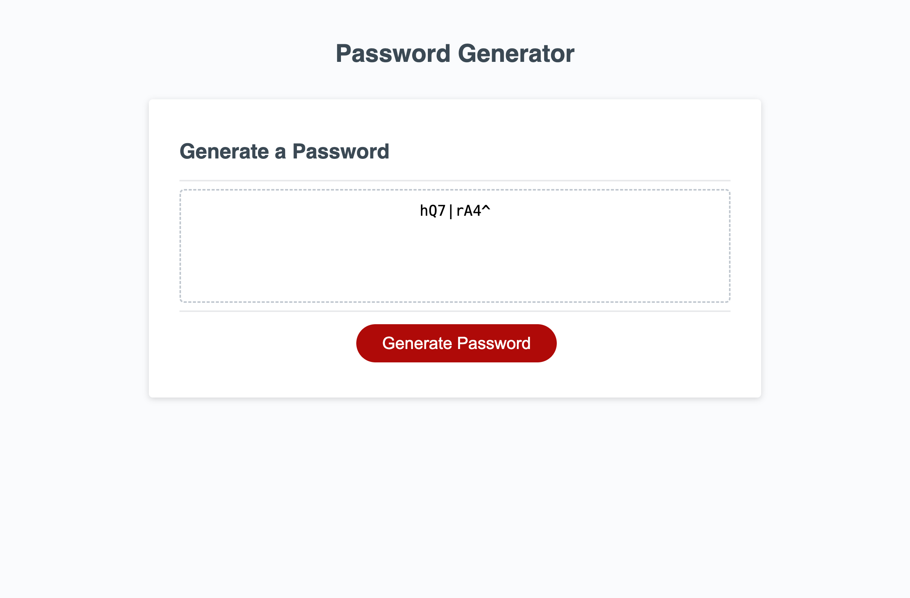

## Name 

Random Password Generator with Requirements

## Description

The goal of this project is to create a web tool that will randomly generate a password based on select criteria. After pressing the "Generate Password" button, the user is presented with requirements for their password including desired length within the 8-128 character range, and the character types they would like to include. 

The window will alert the user if the password length is not a valid number within range or if no character types are selected. 

After submitting the desired requirements for the password, it is displayed onto the text box of the main screen.

## Installation 

N/A

## Usage 
Use the following link to access the deployed webpage: 
https://dymoy.github.io/password-generator/

The source code is found in the root directory of the main branch. 

## Visuals 

### Screenshot of webpage upon rendering 

### Screenshot of the webpage after clicking "Generate password" button 

### Screenshot of the webpage after submitting password requirements

## License 

Please refer to the license in the repo.
